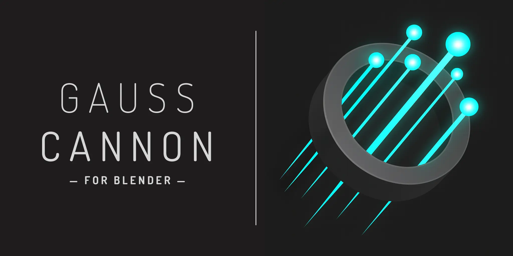
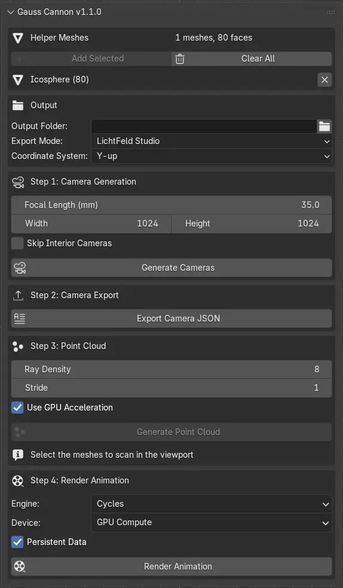

> A powerful Blender add-on for Gaussian Splatting workflows. Generate your camera transforms and point clouds with ease!

[](https://www.blender.org/)
[](LICENSE)



# Overview

**Gauss Cannon** is a comprehensive Blender add-on that streamlines the creation of camera paths and point clouds for Gaussian Splatting and photogrammetry workflows. It provides an intuitive interface for defining camera positions based on mesh faces and exports data in formats compatible with popular 3D reconstruction pipelines.

Created/Maintained by [Arash Keshmirian](https://github.com/keshmirian)

# Features

## Camera Path Generation
- **Helper Mesh System**: Use any mesh object as a template for camera positions
- **Face-Based Camera Placement**: Automatically generates camera keyframes at each face center
- **Smart Camera Orientation**: Cameras face opposite to face normals for optimal coverage
- **Interior Camera Detection**: Option to skip cameras detected inside scene meshes using ray casting
- **Near Clipping Protection**: Automatically skips cameras too close to geometry

## Export Capabilities
- **Multi-Format Camera Export**:
  - LichtFeld Studio compatible format (default)
  - Postshot compatible simplified format
- **Camera Parameters**: Exports full intrinsics and extrinsics with 4x4 transform matrices
- **Scene Normalization**: Automatic AABB scale calculation for consistent processing
- **Coordinate System Options**: Support for both Y-up and Z-up coordinate systems

## Point Cloud Generation
- **Ray-Traced Point Clouds**: Converts selected meshes to accurately-colored PLY point clouds
- **GPU Acceleration**: Fast BVH-accelerated ray casting for improved performance
- **Multi-Frame Sampling**: Generates dense point clouds from multiple camera views
- **Color Preservation**: Captures rendered colors including lighting and materials
- **Resolution Control**: Adjustable sampling resolution (8-1024 pixels)

## User Interface
- **Integrated Panel**: Clean UI in the 3D viewport's N-panel under "Gauss Cannon" tab
- **Real-time Feedback**: Shows face counts, camera positions, and selected objects
- **Visual Status Indicators**: Icons show mesh visibility and selection status
- **Batch Operations**: Combined generate & export functionality with single click

# Requirements

- **Blender**: 4.2.0 or higher

# Installation

1. Download the latest release from [GitHub Releases](https://github.com/keshmirian/gauss-cannon/releases)
2. In Blender, go to `Edit > Preferences > Add-ons`
3. Click `Install...` and select the downloaded `.zip` file
4. Enable the add-on by checking the box next to "Gauss Cannon"

# Usage

### Basic Workflow

### 1. Setup Helper Meshes
```
1. Select mesh objects to use as camera position templates
2. Click the "+" button in the Gauss Cannon panel
3. Helper meshes are automatically hidden from render
4. View face counts and mesh status in the list
```

### 2. Configure Camera Settings
```
- Focal Length: 1-500mm (default: 35mm)
- Resolution: Width × Height (default: 1080×1080)
- Skip Interior Cameras: Enable to avoid cameras inside meshes
```

### 3. Generate Camera Path
```
1. Click "Generate Camera Keyframes"
2. Cameras are created at each face center
3. Timeline adjusts automatically
4. View rejected camera count if interior detection is enabled
5. Camera settings from Gauss Cannon are applied to camera in scene / render settings
```

### 4. Export Camera Data
```
1. Set output JSON path
2. Choose export mode:
   - LichtFeld Studio
   - Postshot
3. Select coordinate system (Y-up or Z-up)
4. Click "Export Camera JSON"
```

### Advanced Features

### Point Cloud Export
```
1. Select target meshes (excluding helper meshes)
2. Configure settings:
   - Output PLY path
   - Resolution: 8-1024 (default: 16)
   - GPU acceleration: Enable for faster processing
3. Click "Generate Point Cloud PLY from Selected"

NOTE: Point cloud export is currently accurate, but super slow. Improvement planned.
```

### Batch Operations
Use "Generate & Export" button to generate camera keyframes and export JSON data in one operation.

# Technical Details

## Camera JSON Export Formats

### LichtFeld Studio Format
```json
{
  "aabb_scale": 2.5,
  "w": 1080,
  "h": 1080,
  "camera_angle_x": 0.6911,
  "camera_angle_y": 0.6911,
  "fl_x": 1388.88,
  "fl_y": 1388.88,
  "cx": 540.0,
  "cy": 540.0,
  "frames": [
    {
      "transform_matrix": [["..."]],
      "file_path": "images/0001.png"
    }
  ]
}
```

### Postshot Format
```json
{
  "aabb_scale": 2.5,
  "w": 1080,
  "h": 1080,
  "camera_angle_x": 0.6911,
  "camera_angle_y": 0.6911,
  "cx": 540.0,
  "cy": 540.0,
  "frames": [
    {
      "transform_matrix": [["..."]],
      "file_path": "images/0001.png"
    }
  ]
}
```

## Point Cloud PLY Format
- **Format**: Binary little-endian PLY
- **Properties**: x, y, z positions + RGB colors
- **Coordinate System**: Configurable (Y-up or Z-up)
- **Color Range**: 0-255 per channel

## Algorithm Details

### Interior Camera Detection
- Uses odd-even ray casting rule
- Counts mesh intersections along ray
- Odd count = inside mesh
- Excludes helper meshes from detection

### GPU Acceleration
- Utilizes Blender's BVH tree structures
- Batch ray processing for efficiency
- Falls back to CPU if GPU unavailable
- Up to 10x performance improvement

# Tips & Best Practices

## Performance Optimization
- Use low-poly meshes as helpers for faster processing. Icospheres work great.
- Enable GPU acceleration for point cloud generation
- Start with low resolution (8-16)
- Use "persistent render data" setting for rendering speed-up

## Quality Considerations
- Higher point cloud resolution = better quality but slower
- Helper face count - invalid cameras = camera count
- Interior detection may slow generation on complex scenes
- Helper meshes should encompass the target object

## Workflow Tips
- Plan camera coverage with simple helper geometry
- Use icospheres or cylinders for 360° coverage
- Preview camera path before exporting
- Test with small datasets first

# Troubleshooting

## Common Issues

**No cameras generated**
- Ensure helper meshes are added
- Check that meshes have faces (not just vertices/edges)
- Verify helper meshes are not deleted
- Verify cameras are not intersecting meshes

**GPU acceleration not working**
- Check Blender GPU compute settings
- Ensure compatible GPU drivers
- Falls back to CPU automatically

**Interior cameras still appearing**
- Enable "Skip Interior Cameras" option
- Check mesh normals are correct
- Ensure meshes are manifold (watertight)

# Contributing

Contributions are welcome! Please feel free to submit a Pull Request.

1. Fork the repository
2. Create your feature branch (`git checkout -b feature/AmazingFeature`)
3. Commit your changes (`git commit -m 'Add some AmazingFeature'`)
4. Push to the branch (`git push origin feature/AmazingFeature`)
5. Open a Pull Request

# License

This project is licensed under the GPL v3.0 License - see the [LICENSE](LICENSE) file for details.

# Acknowledgments

- Blender Foundation for Blender and the amazing Blender Python API
- The Gaussian Splatting community for inspiration and feedback
- The creators of LichtFeld Studio and PostShot
- All contributors and users of Gauss Cannon

# Contact

Arash Keshmirian - [GitHub](https://github.com/keshmirian)

Project Link: [https://github.com/keshmirian/gauss-cannon](https://github.com/keshmirian/gauss-cannon)

---

<p>Made with ❤️ for the 3D reconstruction community!</p>